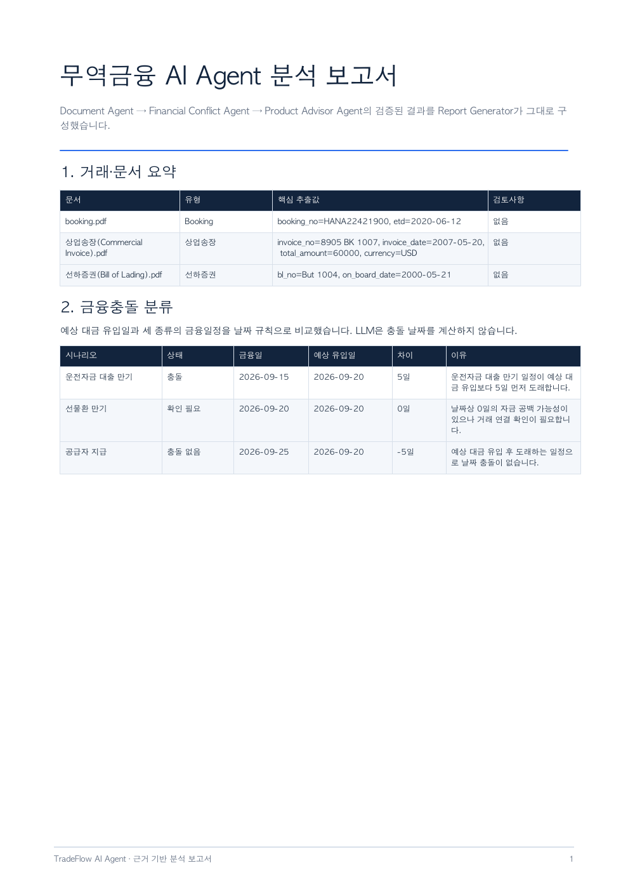
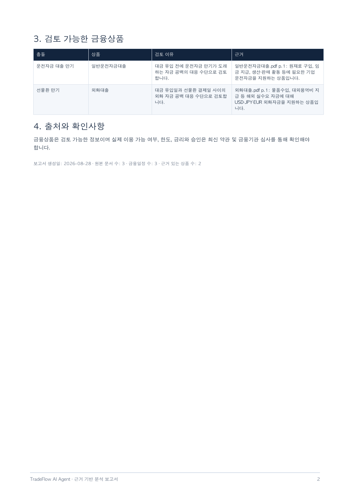
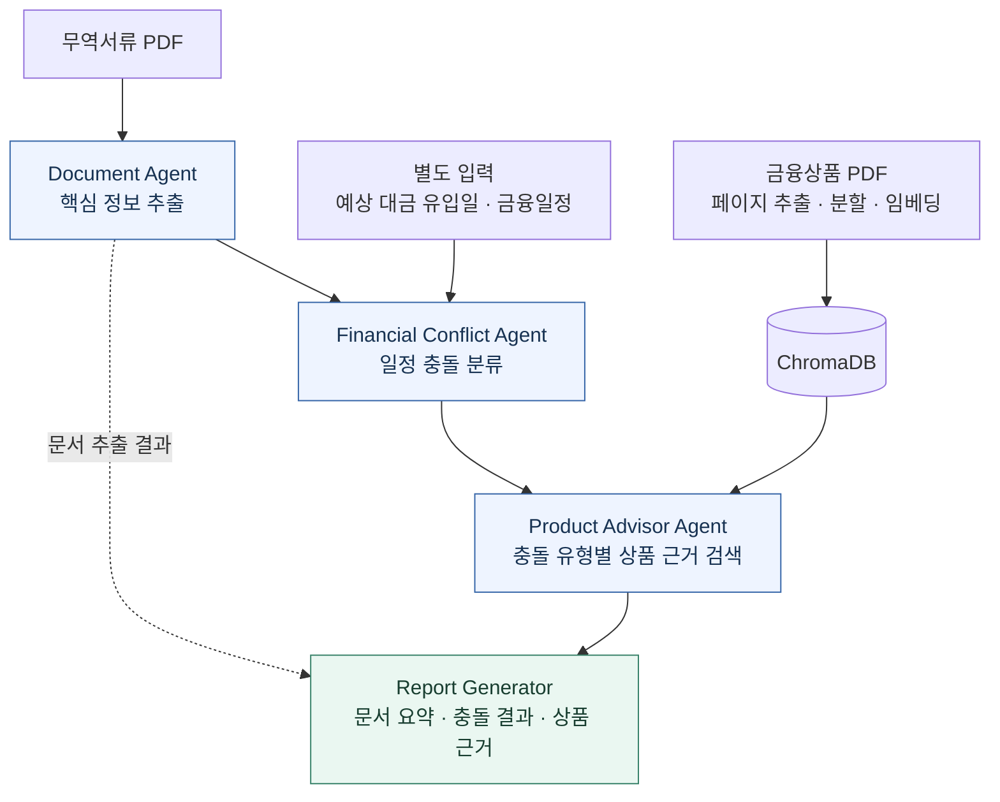

<div align="center">

# TradeFlow

### 무역서류에서 금융일정 확인까지, 하나의 업무 흐름으로

수출입 서류의 핵심 정보를 정리하고, 자금 일정의 충돌을 찾아<br/>
관련 금융상품의 원문 근거와 함께 보고서로 제공하는 업무 자동화 프로토타입

**PDF 문서 분석 · 3개 Agent · 금융상품 문서 검색 · PDF 보고서**

[문제와 해결](#problem) · [결과물 미리보기](#preview) · [시스템 구조](#architecture) · [실행 방법](#quickstart)

</div>

---

<a id="overview"></a>
## 1. 프로젝트 소개

**“수출대금은 20일에 들어오는데, 대출 만기는 15일이라면?”**

TradeFlow는 이런 일정 차이를 확인하고 관련 금융상품 정보를 찾는 과정을 연결합니다. 무역서류 분석, 금융일정 비교, 상품 문서 검색을 세 Agent에 나누어 맡기고 결과를 하나의 PDF 보고서로 구성했습니다.

| 입력 | 처리 | 결과 |
| :--- | :--- | :--- |
| 무역서류 PDF + 예상 대금 유입일 + 금융일정 | 핵심 정보 추출 → 일정 충돌 분류 → 상품 근거 검색 | 문서 요약·충돌 이유·상품 원문 근거가 담긴 보고서 |

대상 사용자는 수출입 기업의 자금 담당자와 관련 거래를 검토하는 금융 담당자입니다. 현재 범위는 **검토에 필요한 정보 정리와 날짜 비교를 자동화하는 프로토타입**입니다.

<details>
<summary><strong>전체 목차</strong></summary>

1. [프로젝트 소개](#overview)
2. [개발 배경과 해결하려는 문제](#problem)
3. [사용 시나리오와 결과물](#preview)
4. [주요 기능과 처리 흐름](#features)
5. [시스템 구조와 기술 선택](#architecture)
6. [설계하고 구현한 부분](#implementation)
7. [구현 결과와 검증 범위](#validation)
8. [실행 방법과 코드 안내](#quickstart)
9. [현재 한계와 개선 방향](#limitations)

</details>

<a id="problem"></a>
## 2. 개발 배경과 해결하려는 문제

공모전을 준비하며 국제통상무역학과 친구들과 수출입 업무를 논의했습니다. 여러 서류에서 날짜와 금액을 찾고, 대금이 들어오는 시점과 돈을 지급해야 하는 시점을 따로 비교하는 반복 작업에 주목했습니다.

책으로 학습한 AI Agent의 역할 분담 구조를 이 문제에 적용했습니다. 필요한 기능을 **서류 확인 → 금융일정 비교 → 상품정보 검색**으로 나누고, 각 단계의 결과를 다음 단계와 보고서에 전달하도록 구현했습니다.

| 담당자가 확인해야 하는 일 | 프로젝트에서 구현한 기능 |
| :--- | :--- |
| 여러 PDF에서 날짜·금액·통화를 찾기 | 문서별 핵심 필드와 해당 페이지 추출 |
| 대금 유입 전에 만기나 지급일이 오는지 비교하기 | 세 종류의 금융일정을 같은 날짜 기준으로 분류 |
| 상황에 관련된 상품 자료를 찾아 읽기 | 충돌 유형으로 검색 범위를 좁히고 PDF 발췌문 반환 |
| 확인한 내용을 별도 문서로 정리하기 | 분석 결과와 근거를 PDF 보고서로 구성 |

<a id="preview"></a>
## 3. 사용 시나리오와 결과물

### 예시: 대금 유입보다 대출 만기가 5일 빠른 거래

| 확인 항목 | 입력 또는 처리 결과 |
| :--- | :--- |
| 예상 대금 유입일 | 9월 20일 |
| 해당 거래와 연결된 대출 만기 | 9월 15일 |
| 일정 비교 결과 | 대출 만기가 5일 먼저 도래 → 날짜상 자금 공백 가능성 표시 |
| 상품정보 검색 | 운전자금 대출 만기 유형에 연결된 금융상품 PDF 검색 |
| 최종 출력 | 일정 차이, 검토할 상품정보, 파일명·페이지·발췌문을 보고서로 제공 |

예상 대금 유입일과 금융일정은 사용자가 별도로 입력합니다. 서류의 선적일이나 송장 발행일을 결제일로 간주하지 않습니다.

### 보고서 미리보기

아래는 **보고서 형식을 보여주는 샘플**입니다. 문서 추출값과 예시 금융일정, 테스트용 상품정보를 조합했으며, 실제 PaddleOCR·E5 모델로 전체 상품 PDF를 검색한 결과를 의미하지 않습니다. 이미지를 클릭하면 크게 볼 수 있습니다.

| 문서 요약과 금융일정 비교 | 상품정보와 원문 근거 표시 |
| :---: | :---: |
| [](docs/assets/report-preview-1.png) | [](docs/assets/report-preview-2.png) |

<a id="features"></a>
## 4. 주요 기능과 처리 흐름

| 단계 | 역할 | 다음 단계 또는 보고서에 전달하는 정보 |
| :--- | :--- | :--- |
| **Document Agent** | PDF에서 문서 종류를 구분하고 핵심 필드 추출 | 날짜·금액·통화, 문서번호, 페이지와 추출 근거 |
| **Financial Conflict Agent** | 예상 대금 유입일과 금융일정을 규칙으로 비교 | 충돌 유형, 상태, 일정 차이, 판단 이유 |
| **Product Advisor Agent** | 충돌 유형에 관련된 금융상품 문서 검색 | 상품명, 검토 이유, PDF 파일명·페이지·발췌문 |
| **Report Generator** | 앞 단계의 구조화된 결과를 PDF로 배치 | 담당자가 확인할 수 있는 분석 보고서 |

Report Generator는 별도 판단을 수행하는 Agent가 아니라 보고서 생성 모듈입니다.

### 다루는 금융일정은 세 가지

| 분류 | 확인하는 질문 |
| :--- | :--- |
| 운전자금 대출 만기 | 거래 대금이 들어오기 전에 대출 상환일이 도래하는가? |
| 선물환 만기 | 외화 대금 유입보다 약정한 외환 결제일이 빠른가? |
| 공급자 지급 | 거래 대금이 들어오기 전에 공급자에게 지급해야 하는가? |

결과는 **충돌 / 확인 필요 / 충돌 없음**으로 표시합니다. 예상 유입일이 없거나 충돌 가능 일정의 거래 연결이 미확정이면 확인을 요청합니다. 동일 날짜도 당일 입금 순서를 알 수 없어 보수적으로 충돌 대상에 포함합니다.

<details>
<summary><strong>문서별 추출 필드 보기</strong></summary>

| 문서 | 핵심 필드 |
| :--- | :--- |
| Booking · 선적예약서 | 예약번호, 출항 예정일 |
| Commercial Invoice · 상업송장 | 송장번호, 발행일, 총금액, 통화 |
| Bill of Lading · 선하증권 | B/L 번호, 본선 적재일 |

추출값에는 페이지, 좌표, 인식 신뢰도, 원문 라벨과 값을 함께 보존합니다. 텍스트 레이어를 이용한 대체 추출의 좌표는 읽기 순서로 만든 가상 좌표이며, 실제 OCR 좌표와 구분합니다.

</details>

<a id="architecture"></a>
## 5. 시스템 구조와 기술 선택



금융상품 색인은 분석 요청 전에 생성합니다. 분석 시에는 저장된 색인을 조회하며, LangGraph가 세 Agent와 보고서 생성 모듈의 실행 순서를 관리합니다.

| 기술 | 사용 목적 | 구현 위치 |
| :--- | :--- | :--- |
| **PaddleOCR / pypdf** | PDF 원문에서 텍스트와 문서 정보 읽기 | [OCR 처리](app/services/ingestion/ocr_backend.py) |
| **LangGraph** | 정해진 순서로 실행하고 단계별 결과 전달 | [워크플로 정의](app/graphs/compiled.py) |
| **ChromaDB / multilingual-e5** | 충돌 상황과 관련된 문서 조각을 저장·검색 | [상품 검색 저장소](app/services/product_vector_store.py) |
| **Pydantic / FastAPI** | 입력·출력 구조를 정의하고 분석 API 제공 | [데이터 구조](app/schemas/portfolio.py) · [API](app/api/main.py) |
| **ReportLab** | 분석 결과를 PDF로 구성 | [보고서 생성](app/services/report_generator.py) |

현재 Agent는 역할별 처리 모듈을 연결한 **고정 순서 워크플로**입니다. 금융일정은 규칙으로 계산하고 상품정보는 검색한 원문을 발췌합니다. 자유서술 답변을 생성하는 LLM 호출은 포함하지 않습니다.

<a id="implementation"></a>
## 6. 설계하고 구현한 부분

### 업무를 세 역할로 나누고 연결

각 Agent의 입력과 출력을 정의하고, 한 번의 분석 요청에서 문서 확인부터 보고서 생성까지 이어지도록 연결했습니다. 문서 분석 결과는 보고서에 보존하고, 금융일정 비교 결과의 충돌 코드는 상품 검색 조건으로 사용합니다.

→ [전체 처리 연결 코드](app/services/portfolio_pipeline.py)

### 날짜 판단의 기준을 명시

`예상 대금 유입일 - 금융일정일`로 차이를 계산합니다. 날짜가 부족하면 확인 필요 상태를 반환하고, 거래와 연결되지 않은 일정은 충돌 대상에서 제외합니다. 이 기준을 코드와 테스트에서 함께 확인할 수 있습니다.

→ [금융일정 분류 규칙](app/services/financial_conflict.py)

### 여러 페이지에서 상품 근거를 검색

금융상품 PDF를 **페이지별 텍스트 → 문서 조각 → 임베딩 → ChromaDB** 순서로 색인합니다. 각 조각에 충돌 코드·상품명·파일명·페이지·원본 해시를 저장해 검색 결과의 출처를 따라갈 수 있게 했습니다.

기본 색인 대상은 **7개 상품, 총 38페이지**입니다. 카탈로그는 상품과 충돌 유형의 연결을 정의하고, 검색할 내용은 PDF에서 가져옵니다. 상품정보는 가입 가능 여부를 확정하는 추천이 아니라 담당자가 검토할 자료로 제공합니다.

→ [상품 카탈로그](data/knowledge/product_catalog.json) · [색인 생성 코드](scripts/build_product_vector_index.py) · [상품정보 반환 코드](app/agents/product_advisor_agent.py)

<a id="validation"></a>
## 7. 구현 결과와 검증 범위

문서 분석·금융일정 분류·상품 검색·보고서 생성을 하나의 요청으로 연결했습니다. 업무시간 절감률이나 현업 도입 효과는 아직 측정하지 않았습니다.

**2026-08-28 구현 검증 기록:** 테스트 23개 통과, Ruff 검사 통과, mypy 검사 통과. 아래 표는 어떤 방식으로 동작을 확인했는지 구분한 내용입니다.

| 검증 대상 | 확인한 범위 |
| :--- | :--- |
| 실제 무역서류 3종 | PDF 텍스트 레이어로 핵심 8개 필드 추출 확인 |
| 금융일정 분류 | 날짜 차이, 동일일, 유입일 누락, 거래 연결 상태 테스트 |
| 실제 ChromaDB | 테스트용 임베딩으로 영속 저장·재접속·시나리오 필터 검색 확인 |
| 상품 PDF 색인 코드 | 테스트용 OCR·임베딩으로 페이지 분할, 출처 보존, 해시 변경 감지 확인 |
| API·워크플로·보고서 | 입력·출력 계약, 4개 노드 실행 순서, PDF 생성 확인 |
| 실제 모델 기반 전체 처리 | PaddleOCR·E5로 상품 PDF 전체를 처리하는 실행은 미검증 |

검증 코드는 [tests/](tests/)에서 확인할 수 있습니다. 이미지 문서의 OCR 품질과 실제 상품 검색의 적합성은 모델을 실행한 별도 평가가 필요합니다.

<a id="quickstart"></a>
## 8. 실행 방법과 코드 안내

**Python 3.12 · uv**를 사용합니다. 아래 명령은 프로젝트 최상위 폴더에서 실행합니다.

### 설치와 상품 색인 준비

```bash
# 개발 도구와 OCR 의존성 설치
uv sync --extra dev --extra ocr

# 대상 PDF와 페이지 수 확인: 7개 상품, 38페이지
uv run python scripts/build_product_vector_index.py --dry-run

# OCR·임베딩 모델을 사용해 실제 ChromaDB 색인 생성
uv run python scripts/build_product_vector_index.py
```

기본 상품 PDF 38페이지는 이미지 기반이므로 OCR이 필요합니다. 최초 색인 생성 시 모델 다운로드와 처리 시간이 발생하며, 색인은 `data/knowledge/chroma_products/`에 저장됩니다.

### 분석 API 실행

```bash
bash scripts/start_api.sh
```

실행 후 `http://127.0.0.1:8000/docs`에서 `POST /api/portfolio/analyze`를 호출할 수 있습니다. API 응답에는 문서 추출값, 충돌 결과, 상품 근거와 생성된 보고서 경로가 포함됩니다. 보고서는 기본적으로 `output/pdf/`에 저장됩니다.

<details>
<summary><strong>API 요청 예시</strong></summary>

무역서류 경로는 API 서버가 읽을 수 있는 로컬 PDF 경로입니다.

```json
{
  "document_paths": [
    "kb_doc/booking.pdf",
    "kb_doc/상업송장(Commercial Invoice).pdf",
    "kb_doc/선하증권(Bill of Lading).pdf"
  ],
  "expected_receipt_date": "2026-09-20",
  "financial_events": [
    {
      "event_id": "LOAN-001",
      "scenario_code": "WORKING_CAPITAL_LOAN_MATURITY",
      "event_name": "운전자금 대출 만기",
      "event_date": "2026-09-15",
      "amount": 50000,
      "currency": "USD",
      "link_status": "CONFIRMED"
    }
  ]
}
```

예시 일정은 문서 형식 확인용 PDF와 조합한 가상 입력이며 실제 거래를 나타내지 않습니다.

</details>

<details>
<summary><strong>LangGraph 개발 서버와 테스트</strong></summary>

LangGraph 개발 서버는 `langgraph.json`에 정의된 `portfolio` 그래프 하나를 공개합니다. 이 설정은 `.env` 파일을 읽으므로 실행 전에 예시 파일을 복사합니다.

```bash
cp -n .env.example .env
bash scripts/start_langgraph_dev.sh
```

검증 명령:

```bash
uv run pytest -q
uv run ruff check app tests scripts
uv run mypy app
```

</details>

### 핵심 코드 위치

```text
app/
├── agents/          # 문서 분석 · 금융충돌 · 상품정보 Agent
├── services/        # OCR, 날짜 비교, 검색, PDF 생성
├── graphs/          # 실행 순서와 공유 상태
├── schemas/         # 입력·출력 데이터 구조
└── api/             # 분석 API
data/knowledge/      # 상품 카탈로그와 생성된 검색 색인
kb_doc/              # 무역서류 및 금융상품 PDF
scripts/             # 색인 생성과 서버 실행
tests/               # 단위·통합·API·구조 검증
docs/assets/         # README 보고서 미리보기
```

<a id="limitations"></a>
## 9. 현재 한계와 개선 방향

- **거래 조건 입력:** 예상 대금 유입일과 금융일정은 별도 입력값입니다. 서류에서 결제 조건을 해석해 유입일을 계산하는 기능은 현재 범위에 포함되지 않습니다.
- **판단 범위:** 날짜상 일정 충돌을 찾습니다. 잔액·신용한도·환율까지 반영한 실제 자금 부족이나 상품 적격성 판단은 수행하지 않습니다.
- **모델 품질:** 다양한 서류 양식의 OCR 추출 정확도와 실제 임베딩 검색 품질은 추가 검증이 필요합니다.
- **다음 개선:** 실제 모델 기반 검색을 평가하고, 필드별 추출 정확도와 충돌 유형별 검색 적합성을 기록할 계획입니다.

---

<sub>공모전 아이디어를 바탕으로 개발한 개인 학습·구현 프로젝트입니다. 금융상품 정보는 검토 참고용이며, 금융기관의 공식 서비스나 대출 승인 결과를 의미하지 않습니다.</sub>
